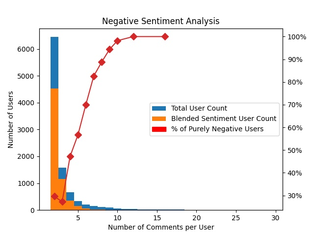

# Recommendation System - Author Based

This is one of two Google Play Store app recommendation systems for EECS 6414 Team 2.
This constructs a top 5 recommended apps list for each relevant user based on the comments of similar users.

## Packages Utilized

This relies on a number of packages and frameworks, which includes:
VADER Sentiment, NetworkX, PyLab, Pandas, and MatPlotLib

## How it Works

The program takes a user comment list and checks each user against a set of preprocessed sentiment lists to construct an initial sentiment based bipartite network topology graph.
Essentially building off of the bones of our original network topology program.
From here the program generates a folded graph based on the author nodes of the network topology. Authors that share a comment on an app will have an edge on the subsequent folded graph.
Only comments with positive sentiment are considered to make sure the users share a positive common interest.
Then the program will take the folded graph and generate a new bipartite graph linking comment authors to apps that authors with similar interests commented on that they didn't.
The Jaccard Coefficient is then employed on these author to author relationships to produce a ratio value that determines the number of times two authors are linked through apps they commented on.
This ratio is passed to the new bipartite graph as the weight of the edge between an author and their recommended app.
In instances where an author is recommended an app through more than one related author the mean of these Jaccard Coefficient values will be taken and utilized instead.
These edges can then be hierarchically ranked in descending order to give a ranked to give a list of all recommended apps for an author.
From this list the program takes the top 5 to give as output.

## Input File

A user comment list (frequency csv file) is required to create the files necessary to produce the recommendation output.
This file has a list of users with all of the apps they have commented on.

A csv list of all apps is required as well.

## How to Run

To run the program you can type the following into your terminal:

> python main.py

At this point you will be prompted with two questions:

- The first will ask if you would like to update the graph data.
This is necessary for your first run, but if it's already been processed, and the frequency file is unchanged, you can skip it.

- The second will ask if you would like to input a name.
If you choose to, and the name is present in the current data, then a top 5 list of app recommendations will be displayed in the terminal.

## Negative Sentiment Analysis

We also added a program to measure how author sentiment grows increasingly negative based on author activity.
The output of this program on an anlysis of 10k users can be seen below.

## Disclaimer

Due to the proprietary nature of the data utilized we are unable to add it to this repository.
We would like thank Dr. Nayebi for giving us access to said data.
